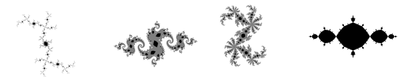

# julia-tsa-core
Julia sets with a mathematical guarantee

Implementation of the article:
```
"Images of Julia sets that you can trust"
by Luiz-Henrique de Figueiredo, Diego Nehab, Jofge Stolfi, Joao Batista Oliveira-
from 2013
```

## Purpose of this C++-code:

Command line tool to compute quadratic Julia sets with a mathematical guarentee.


## README is organized as:

0. Quick start 
1. Background information on the algorithm and the current implementation here
2. Computing some example sets explaining the features of the code
3. Command-line parameters
4. Higher polynomials as iterating functions
5. Contact and links


## (0) Quick starting example:



Compile main.cpp with any suitable C compiler supporting 64-bit integers (best with mathematical optimizations
for speed enabled)

Start executable (assuming it's called juliatsacore.exe throughout  README):

`juliatsacore.exe 4096 -1 0 2 6` 

in a command prompt.

The resulting file `_tsa_juliaset_Y00X00.bmp` is a 4-bit bitmap that represents the classical basilica Julia set.

Note the black interior, the white exterior and the gray cells containing the boundary as described in the article.


## (1) Background

Contrary to the article, I did not implement a quad-tree representation. The code works
on a contiguous array (or several parts of 2 GB length) to get the fastest access times.
Each screen pixel represents a square in the complex number plane and needs 2 bits in memory for
color storage, grouped as 16 pixels in a 32-bit integer. Some overhead to speeden computation 
up is needed, but most of the memory present will be used for the image itself.

For the final image, the following claims hold:

A black pixel means ALL complex numbers within the underlying square (including the edges
and corners) are starting points for bounded orbits and belong to the interior of the filled-in Julia set.

A white pixel means ALL complex numbers within the underlying square (including the edges
and corners) are starting points for escaping orbits and belong to the exterior.

Only gray pixel can (but do not have to) contain complex numbers that belong to the Julia set boundary itself 
and might or might not contain numbers belonging to the exterior and/or interior. In a larger image those gray squares 
will be split up and might then be colored to a definite interior or exterior.

During computation there are 4 colors: *black* and *white* as above, *gray* meaning pixel is unclear, and *gray-but-potentially-white*.
The latter meaning that at least one path from that square leads to the exterior. The software works in a main loop
in the routine `propagate_white` that goes over the image again and again until no color change (from gray to 
either white or potentially-white) occurs, then all gray pixels are bounded and can be colored black.

The software takes command line arguments and constructs the desired quadratic Julia set.
Ever so often temporary raw data is written to the hard drive, so the computation can be stopped
by simply closing the command prompt window.

Memory overhead to speeden up the computation includes that every row has a specific min and max
x coordinate value where the gray for that row resides. Those values will be adjusted if pixels are
judged as interior or exterior. At the beginning a static reverse cell graph in a low resolution
(usually 64x64 to 256x256 pixels were put together in a tile) and the preimages of every tile are
computed. When a gray pixel changes its color the preimages' tiles are set to *have to be visited*
and checked in one of the next rounds.

The main routine is `compute()`, the main struct is `data5` and the most important variables are `SCREENWIDTH`
and `seedCre`, `seedCim`.

The software first tries to find a file named `_in.raw_header`. If that exists
the raw data (in the files named `_in.raw_0001`, `_in_raw_0002` and so on) is loaded and 
computation will be resumed, i.e. starting with searching for new white cells by the function `propagate_white()`.

A special case is when the read-in data was computed with half the current command line screen
width. In that case the read-in image is doubled, every pixel is copied to a 2x2 grid keeping
its color and computation resumes in the higher screen width - simulating the refinement process
as described in the article. This might save computation time when screen width is around 64k or higher by using
previously computed information (for 16k or less I just compute the image from scratch). However information of potentially-white cells is lost during that blow-up process and all gray and gray-but-potentially-white cells of the original raw data are set to gray.

The software does hardly any error checking and was designed mainly for speed and complete memory usage, the function `getBoundingBoxfA` for ease of entering new automatically generated functions (see point 4).
If a checked-for error occurs, it prompts a message and exits immediately "dirty", leaving garbage collection
to the command-line window.

The output of the code are several files:

`_tsa_juliaset_Y00X00.bmp`
	which is a 4-bit bitmap representing the image (at most 2 GB in size, if the resulting file would be bigger,
	the image is tiled into appropriate parts (hence the YX-part of the name), starting
	from bottom to top and left to right)

`_tsa_juliaset_twd16.bmp`
	if the screen width is 2^14 or more, the current data is 16-fold downsized in a trustworthy manner 
	- meaning, if a 16x16 grid is all in one color, the resulting 1 pixel in the downscaled image is set 
	to that color, otherwise it will be gray.
	That image is just saved without file size check for now as an 8-bit bitmap.

files named `_tsa_juliaset.raw_NNNN` with NNNN being a number from 1 to as much as needed (again,
	2 GB as maximum file size) and a file `_tsa_juliaset.raw_header`. Those store the raw data so that
	the computation can be resumed or a bigger screen width can be computed using already generated information.

and the `_temp.raw_*` files as mentioned above, in case the computation is interrupted by user, software or
	hardware crash. 


## (2) Examples and features

#### (a) Computing small images from scratch

Enter one of the following lines in a command prompt.

`juliatsacore.exe 256 0.25 0.0078125 2 6`
 
 or
 
`juliatsacore.exe 8192 -0.203125 0.6953125 2 6`

#### (b) Resuming computation

Start a computation with the following command:

`juliatsacore.exe 16384 -1 0 2 6`

At some point the message *saving raw data as temporary* appears. If the computation
continues after that, stop the command-line window before the image is calculated
completely.

The software saved the files `_temp.raw_header` and `_temp.raw_0001`.
Rename those to `_in.raw_header` and `_in.raw_0001`.

And start the computation again with the same command. The software then continues judging
pixels using all the information that has been calculated thus far.

Delete the `_in_raw*` files if no longer needed as the software always first tries to use those files if present.

#### (c) Increasing an image to a higher screen width

Compute a small version of the basilica (deleting `_in.raw*` files beforehand).

`juliatsacore.exe 2048 -1 0 2 6`

Rename the file `_tsa_juliaset.raw_0001` to `_in.raw_0001` and `_tsa_juliaset.raw_header` to `_in.raw_header`.

Then start the software again with double the screen width:

`juliatsacore.exe 4096 -1 0 2 6`

The software uses the already computed image to build a bigger version. Usually up to 16k one computation
round is fast enough. Then one might benefit from already definitely colored pixel (however I did not measure
that). Afterwards delete `_in.raw*` files.


## (3) Command-line parameters;

The general usage is (parameters must be in that order and all must be present).

The above example: `juliatsacore.exe 4096 -1 0 2 6`

**4096** [screen width in pixels] (32 bit positive integer, if invalid, 8192 is the standard)

**-1** [seed value's real part] (double floating point, if invalid, 12967936/33554432 is standard)

**0** [seed value's imaginary part] (double floating point, if invalid 4710400/33554432 is standard)

**2** [bailout] (32 bit positive integer, if invalid 2 is standard)

**6** [size of reverse cell graph tile] (32 bit positive integer, if invalid 6 is standard)

Image width must be a power of 2 so that corner points of a square can be accurately represented by the
underlying double floating point type. Images must be at least 256 pixels and can go up to
2^31 in principle. The largest I computed thus far is, however, 2^18 pixels in width.

Number representability is also a prerequisite for the seed values, hence any value p/q where q is a power
of 2 can be accurately represented. 

In the quadratic case, a bailout of 2 is mathematically sufficient. For higher 
order polynomials (see 4), the value must be adapted to accomodate for larger shapes. The complex
plane represented on the screen goes from -bailout to +bailout in both axis. Integer bailout is
used so that a pixel has a plane width that can always be accurately represented (2*bailout / SCREENWIDTH).

Size of reverse cell graph is a means to speeden up computation by storing a low-resolution
static reverse mapping (preimages of a bounding box). A value of 6 is minimum and corresponds
to a tiling of 2^6 x 2^6 pixels and can in general be used up to an image width of 2^16, for 2^17 a value
of 7 is recommended to keep memory usage low, for 2^18 a value of 8 is a good start. In case the
value is too low, the program stops with the error message *Too many parents*.


## (4) Other iterating functions

The iteration is simulated by computing a bounding box for a square A (a pixel) on the screen.
calculated by the function `getBoundingBoxfA`. It was built by splitting the quadratic
iteration `z := z^2+c` in its real and imaginary part and then using interval arithmetics on
the real part of A [x0..x1] and the imaginary part of square A [y0..y1].

The file `_bounding_boxes_other_iterating_functions` in the repository contains `getBoundingBoxfA` definitions that can be
substituted for the current one in the main.cpp file to calculate other Julia sets with
mathematical guarentee. Care however must be taken, that the computed values during bounding box 
evaluation be accurately representable at any time. E.g. if the corner x coordinate is 2^-16,
a 3rd order polynomial will result in 2^-48 which can be represented, but a 4th order polynomial
would result in 2^-64 which is not representable. In the latter case image width must be adapted appropriately.
Long double, integer arithmetics or libraries providing arbitrary precision floating point could be used in that case.

Polynomials for which bounding boxes were included:
- cubic z^3+c
- quartic z^4+c
- pentic z^5+c

Bailout must be increased (see article above, paragraph 7, **Extension to higher-degree polynomials**).


## (5) Contact

Please direct coding errors, weird behaviour, records achieved, time consumption for sets computed,
parallelization efforts, arbitrary precision library usage or generally any comments to:

marcm200@freenet.de

forum: https://fractalforums.org/fractal-mathematics-and-new-theories/28/julia-sets-true-shape-and-escape-time/2725

Marc Meidlinger, July 2019

