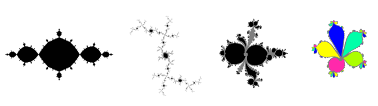

# julia-tsa-core
Julia sets with a mathematical guarantee

Implementation of the excellent articles:
```
"Images of Julia sets that you can trust"
by Luiz-Henrique de Figueiredo, Diego Nehab, Jofge Stolfi, Joao Batista Oliveira-
from 2013

"Rigorous bounds for polynomial Julia sets"
by Luiz-Henrique de Figueiredo, Diego Nehab, Jofge Stolfi, Joao Batista Oliveira-
```

## Purpose of this C++-code:

Command line tool to compute polynomial Julia sets of the form z^n+A*z+c for degree 2 to 8 with a mathematical guarentee, their immediate
and attraction basins of cycles and the periodic points.

### Disclaminer

Although I tried my best to ensure correctness of the implementation and therefore the results,
the code comes with no warranty.

## README is organized as:

0. Quick start 
1. Background information on the algorithm and the current implementation
2. Computing some example sets explaining the features of the code
3. Command-line parameters
4. Contact and links
5. CONVERTING data files from previous versions


## (0) Quick starting example:



Compile main.cpp with any suitable C compiler supporting 64-bit integers (best with mathematical optimizations
for speed enabled). 

Start executable (assuming it is called juliatsacore_d.exe throughout README - d stands for the C++ double datatype,
other types see (1)) by entering in a command prompt:

`juliatsacore_d.exe func=z3azc len=10 cmd=period,pp a=1.25,0 c=0,0.025 range=4` 

if memory is not an issue, use:

`juliatsacore_d.exe func=z3azc revcg=4 precompute=8 len=10 cmd=period,pp a=1.25,0 c=0,0.025 range=4` 
which allocates 8 GB of memory to store intermediate reusable results.

The output are 4 files, all leading with _L10__z3azc_c_ia_0_0_x_0.02499997615814209_0.02499997615814209_A_1.25_0`.
The file ending in `.raw` stores the internal data for each pixel.
The file ending in `_period.bmp` shows the basins of attraction - immediate basins are in bright colors.
The file ending in `_periodic_points.bmp` shows the basins and additionally the regions of the periodic points - black pixels.
The file ending in `_Y00X00.bmp` depicts the standard result of the algorithm - interior (black), exterior (white), unknown (gray).

A very interesting example - fpa (32 bit inetger/96 bit fractional) precision needed to be mathematically accurate - for basins of attraction is:

`juliatsacore_fpa.exe func=z6azc cmd=period len=12 a=1.0625,0 c=0,0.0234375 revcg=4 range=4`


## (1) Background

Contrary to the article, I did not implement a quad-tree representation. The code works
on a contiguous array (or several parts of 2 GB length) to get the fastest access times.
Each screen pixel represents a square in the complex number plane and needs 2 bits in memory for
color storage, grouped as 16 pixels in a 32-bit integer. 

For the final image, the following claims hold:

A black pixel means ALL complex numbers within the underlying square (including the edges
and corners) are starting points for bounded orbits and belong to the interior of the filled-in Julia set.

A white pixel means ALL complex numbers within the underlying square (including the edges
and corners) are starting points for escaping orbits and belong to the exterior.

Only gray pixel can (but do not have to) contain complex numbers that belong to the Julia set boundary itself 
and might or might not contain numbers belonging to the exterior and/or interior. In a larger image those gray squares 
will be split up and might then be colored to a definite interior or exterior.

During computation there are 4 colors: *black* and *white* as above, *gray* meaning pixel is unclear, and *gray-but-potentially-white*.
The latter meaning that at least one path from that square leads to the exterior. 

The software works in a main loop
in the routines `propagate_definite` and `propagate_potw` that goes over the image again and again until no color change occurs anymore, then all gray pixels are bounded and can be colored black. Furthermore if computation of an image
is continued in a larger screen width, the software also recognizes gray cells as being black if
all paths lead directly in one iteration to other black cells.

The software takes command line arguments (in no particular order) and constructs the desired Julia set.
Ever so often temporary raw data is written to the hard drive, so the computation can be stopped
by simply closing the command prompt window.

Memory overhead to speeden up the computation includes at the beginning a static reverse cell graph in a low resolution
(usually 16x16 to 256x256 pixels were put together in a tile) and the preimages of every tile are
computed. When a gray pixel changes its color the preimages' tiles are set to *have to be visited*
and checked in one of the next rounds.

The desired and necessary C++ data type for the computation of the bounding box can be commented in or out
at the start of the source code:

`#define _DOUBLE`
`#define _LONGDOUBLE`
`#define _QUADMATH`
`#define _FPA`
`#define _F107`
`#define _F161`

and then recompiling the software.

FPA is a fixed-point number structure providing 32 bit integer part and 96 bit fractional part. 

F107 is Robert Munafo's f107 double-double datatype, which is quite fast (about long double speed for some images).
If those are commented in, the files f107_o.cpp and f107_o.h need to be downloaded from
https://mrob.com/pub/math/f161.html#source
Make sure to comment out approximate computation: `//#define F107_APPROX 1`

F161 is the respective triple-double type by Robert Munafo. F107 notion apply.

The main routine is `compute()`, the main struct is `data5` and the most important variables are `SCREENWIDTH`
and `seedC0re`, `seedC0im`, `seedC1re`, `seedC1im` and `FAKTORAre`, `FAKTORAim`.

The software first tries to find a file named `_in.raw`. If that exists, it is loaded and 
computation will be resumed, i.e. starting with searching for new definite color cells (white and black) by the function `propagate_definite()`, followed by `propagate_potw`.

A special case is when the read-in data was computed with half the current command line screen
width. In that case the read-in image is doubled, every pixel is copied to a 2x2 grid keeping
its color (except gray-but-potentially-white which must be reset to gray) and computation resumes in the higher screen width - simulating the refinement process
as described in the article. This might save computation time when screen width is around 64k or higher by using
previously computed information (for 16k or less I just compute the image from scratch). 

The software does not perform many error checks and was designed mainly for speed and complete memory usage.
If an error occurs, it prompts a message and exits immediately "dirty", leaving garbage collection
to the command-line window.

The output of the code are several files: 

Files starting with e.g. _L10_z3azc_c_ia_0_0_x_0.025_0.025_A_1.25_0`

ending `.raw` - pixel information stored to resume computation.

ending `Y00X00.bp` A black/white/gray image to depict the definite areas.

ending `_periodic_points.bmp` Showing the basins of attraction (colored, imemdiate basins bright colors, attraction basin, pale) and the periodic points (black)

ending `_period.bmp` shwoing the basins of attraction.

Number representability is a prerequisite for the polynomial coefficents given in the command line, 
any value p/q where q is a power
of 2 can be accurately represented. Fractional numbers provided for c and A are internally made
representable by performing: floor(number provided * 2^25) / 2^25.

The software performs a preliminary check if the currently
used C++ data type is offering enough bits for the current resolution,
function and complex number range. This information is predtermined using my bitPrec project, and works here for
ranges 2, 4 or 8 (see below) and absolute real and imaginary part of c and A below 2.

In the quadratic case, a bailout of 2 (range=2) is mathematically sufficient. For higher 
order polynomials, the value must be adapted to accomodate for larger shapes. The complex
plane represented on the screen goes from -bailout to +bailout in both axis. Integer bailout is
used so that a pixel has a plane width that can always be accurately represented (2*bailout / SCREENWIDTH).

The first article above, paragraph 7, **Extension to higher-degree polynomials** depicts
an estimate for general polynomials. For the functions provided in the software a value 2+|c|+|A| is sufficient, usually for the values used, 4 is taken. Too high a bailout is working, too low will compromise the mathematical guarantee for white cells.


## (2) Examples and features

#### (a) Computing small images from scratch

Enter one of the following lines in a command prompt.

`juliatsacore_d.exe cmd=calc func=z2c c=-1,0 len=10`

`juliatsacore_fpa.exe func=z6azc cmd=period len=11 a=1.0625,0 c=0,0.0234375 revcg=4 range=4`


#### (b) Resuming computation

Start a computation with the following command:

`juliatsacore_d.exe func=z2c cmd=calc c=-1,0 len=14`

At some point the message *saving raw data as temporary* appears. If the computation
continues after that, stop the command-line window before the image is calculated
completely.

The software saved the file `_temp.raw`.
Rename this to `_in.raw`.

And start the computation again with the same command. The software then continues judging
pixels using all the information that has been calculated thus far.

Delete the `_in_raw` file if no longer needed as the software always first tries to use those files if present.

#### (c) Increasing an image to a higher screen width

Compute a small version of the basilica z^2-1 (deleting `_in.raw*` files beforehand).

`juliatsacore_d.exe len=11 cmd=calc c=-1,0 func=z2c`

Rename the final file `_L11_...raw` to `_in.raw`.

Then start the software again with double the screen width, i.e. len=12:

`juliatsacore_d.exe c=-1,0 func=z2c cmd=calc len=12`

The software uses the already computed image to build a bigger version. Afterwards delete `_in.raw`.

(d) Splitting a cycle

Using the 2-iterate function, it is possible to split even-length cycles in the quadratic case into 2 smaller cycles.

`juliatsacore_fpa.exe revcg=4 precompute=16 func=2itz2c len=15 cmd=period,m3 range=2 c=-0.22412109375,-0.75439453125`

Note, this command allocates 16 GB of memory to store bounding boxes (more precisely the pixels they intersect with) for
reusage. If memory is not sufficient, remove the precompute=16 part.

Note, the computation of level 16 with that command is quite slow and should be done in an increasing manner, starting with .e.g.
level 12. 

The same Julia set can be computed with:

`juliatsacore_d.exe revcg=4 func=z2c len=15 cmd=period range=2 c=-0.22412109375,-0.75439453125`


## (3) Command-line parameters;

`FUNC=string` (if not provided, standard value is Z2C)
The desired polynomial to use. Implemented are z2azc, z3azc ... until z6azc for the polynomials z^n+A*z+c, where
the degree n is from 2 to 8 and the factor A is a complex number. For backward compatibility a special function
FUNC=z2c for z^2+c is also implemented.

Function 2ITZ2C is a 2-iterate version of the classic z^2+c, i.e. (z^2+c)^2+c that allows for cycle splitting.

`CMD=string` (standard value CALC)
1. CMD=CALC: The software computes the set, saves the image and the final data.
2. CMD=PERIOD: The software tries to find the immediate basins of attracting periodic points if present
and colors them. If no _in.raw file are present, the set is calculated from scratch.
3. CMD=PERIOD,PP: After finding a cycle, the software tries to find regions where the periodic points can lie. Text output is a number
of rectangles that circumference geometrically connected periodic points' regions. 
Periodic point detection is very memory-demanding (several GB).

Note, the image itself shows a bit more detail, usually
having non-rectangular point regions. Image saved is named `...periodic_points.bmp`
Note, that the union of all black regions contains the periodic points, however there can be more distinct black regions
than actual periodic points.

4. CMD=PERIOD,M3: A new periodicity method that detects solely immediate basins but at a low memory cost and is applicable for levels 19 and
above.

`CMD=FASTDTCHK` 
The current data file _in.raw is loaded and every gray pixel is analyzed: the set of pixels its bounding box intersects with
is both computed with a sufficient datatype (the number type, the compiled executable owns) and once with C++ double. If both
are identical among the image, double can safely be used to obtain a mathematically gauranteed image - but in much
less time.

E.g. if FPA is needed to provide sufficient precision, test this against double using the already correct level 16 data,
so rename L16_....raw to _in.raw

'juliatsacore_fpa cmd=fastdtchk len=17 func=...`

If test is passed (output on screen and stored textfile named `_L17_...PASSED` or `_FAILED`), the image itself can be computed with:

`juliatsacore_d cmd=period,m3 len=17 func=..`

`LEN=integer` (standard value 10)
The screen width is set to 2^integer pixel.
Images must be at least 2^8 pixels and can go up to
2^31 in principle. The largest I computed thus far is, however, 2^20 pixels in width.

'C=double1,double2`
Sets the seed value: double1 as real part, double2 as imaginary part.

`C=double1,double2,double3,double4`
Sets the seed value to a complex interval: The real part being [double1..double2], the imaginary part
being [double3..double4]

`Cd=x,y`
x,y are int32_t values that are used to denote the complex number x*2^-25 + i*y*2^-25

`Cd=x0,x1,y0,y1` similar

`A=double1,double2`
Sets the degree-1 coefficiant accordingly.

`Àd=x,y`
Denotes A=x*2^-25 + i*y*2^-25

<b>Note</b> that real numbers given in the command line as parameters are always treated as C++ double, no matter 
what underlying data type is used in the binary.

`RANGE=integer` (standard value 2)
The complex plane where the whole Julia set is definitely contained is set to -integer .. +integer in
both axis. Value must be a power of 2. The boundary itself cannot be part of the Julia set.

`REVCG=integer` (standard value 4)
The reverse cell graph to speeden computation up uses groups of 2^integer x 2^integer pixels.
The larger the integer, the less space the reverse cell graph needs and more memory is usable for
the image itself. Whether the reverse graph speeds the current computation up or not is dependent
on the function and the coefficients. 
Numbers below 4 are not possible. 

<b>Note</b> if available memory is not sufficient for image size and size of reverse cell graph,
the program will terminate with a memory bad_alloc error message. Increasing the REVCG parameter
will reduce memory usage.

`PRECOMPUTE=N` (standard: flag not used)
If memory is not an issue, N gigabytes of memory are assigned to precompute whole bounding boxes, i.e.
their intersecting pixels and stores them for future use.


## (4) Contact

Please direct any comments to:

marcm200@freenet.de

forum: https://fractalforums.org/fractal-mathematics-and-new-theories/28/julia-sets-true-shape-and-escape-time/2725

Marc Meidlinger, March 2020

## (5) CONVERTING data

The data format is identical to 2.0.

Raw data files from version 1.0 (files `_in.raw_header, _in.raw_0001` etc) need to be converted into
the new file structure to be reused.

Copy the raw-files of choice into a directory, rename them to _in.raw_header, _in.raw_0001 etc as if intending to
resume computation with the older versions, and call the current version (datatype is not relevant, other command-line parameters
are ignored)

`juliatsacore_d cmd=convert`

The software saves one file named `_2d.raw` which contains all information. This file can then be used to resume computation
with the new version, detect cycles or periodic points.

